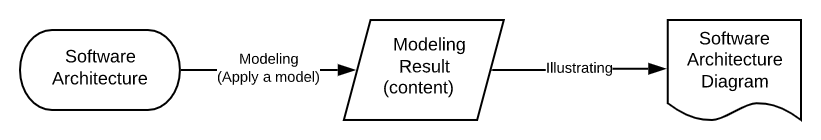

소프트웨어 구조에 대한 사람들의 질문은 대부분 다음 질문으로 귀결 됨.

> 소프트웨어에 어떤 시스템이 있고 각 시스템은 서로 어떤 관계인가?

### 다이어그램 그리는 방법

소프트웨어 구조 다이어그램을 그릴 때 모델링 영역과 일러스트레이팅 영역을 구분해야 한다 -'Avi Flax'

- 모델링  
  특정 모델(이론)을 기반으로 소프트웨어 구조에 어떤 요소들이 있고 각 요소가 어떤 관계를 맺고 있는지 파악하는 것

- 일러스트레이팅  
  모델링으로 파악한 요소와 그 관계를 시각적으로 표현하는 것

모델링 결과는 소프트웨어 구조 다이어그램 작성 과정의 중간 콘텐츠라고 볼 수 있고,
일러스트레이팅은 이를 시각적으로 나타내는 다이어그램 프레젠테이션 기법.

협업하기 쉬워짐(Collaboration)
변경 사항을 쉽게 동기화할 수 있는 구조가 됨(Consistency)
콘텐츠에 집중할 수 있음(Focus)
텍스트 기반으로 작업할 수 있음(Text, Docs as Code와 같은 전략 적용 가능)
소프트웨어 구조 모델을 데이터로 관리할 수 있음(Data)

---

### 소프트웨어 구조 다이어그램 작성 방법이 갖춰야 할 특징

내가 기똥차게 그려도 협업자 또는 그림을 보는 독자가 같은 관점이나 기준으로 그림을 이해한다는 보장은 없다.

그렇다고 모든 조건을 들어주다간 완성이 안된다. 적어도 아래의 3가지 특징은 마음 속에 새겨야된다.

- 다이어그램을 작성하고 유지 보수하는 데 드는 비용과 시간이 적어야 한다.
- 일관된 구조 뷰와 정확한 표기 기준에 맞춰 그릴 수 있어야 한다.
- 구조 뷰나 적용 모델은 소프트웨어 개발 관계자라면 누구나 이해하고 그릴 수 있도록 어렵거나 복잡하지 않아야 한다.

- [C4 모델과 C4-PlantUML을 이용한 소프트웨어 구조 다이어그램 만들기](https://engineering.linecorp.com/ko/blog/diagramming-c4-model-c4-plantuml)

---

#### C4 모델

> Simon Brown이라는 사람이 UML과 4+1 아키텍처 뷰 모델을 기반으로 만든 모델
>
> 시스템 콘텍스트(Context)와 컨테이너(Container), 컴포넌트(Component), 그리고 코드(Code) 순서로 다이어그램의 수준(level)을 달리하여 소프트웨어를 작은 단위로 분해해가는 방식으로 모델링하는 기법이고,
>
> C4는 각 수준에 공통으로 들어가는 알파벳 'C'의 개수를 의미합니다. 이 모델은 널리 알려진 애자일 방법론과 같이 소프트웨어 개발을 기민하게 진행하는 상황에서 소프트웨어의 구조를 빠르고 효율적으로 공유하고 지속적으로 업데이트할 때 사용하도록 권장하고 있으며, 정적인 뷰(static view)의 소프트웨어 구조를 나타내는 데 적합합니다.

- [Simon Brown이 C4모델 설명하는 유튜브 영상](https://youtu.be/x2-rSnhpw0g)

#### C4 모델 추상화 요소.

- 사용자(person)  
  사용자나 역할 등을 표현하는 요소이며 소프트웨어 시스템의 사용자를 나타냅니다.

- 소프트웨어 시스템  
  최상위 추상화 요소로 시스템이 어떤 가치를 제공하는지 나타내며 보유하거나 개발하고 있는 소프트웨어와 연동되는 소프트웨어를 나타낼 때 사용합니다.

- 컨테이너  
  소프트웨어 시스템의 내부를 표현하는 추상화 요소로 애플리케이션이나 데이터 저장과 관련된 솔루션을 나타낼 때 사용합니다. Docker의 컨테이너 개념과는 다르며 서버 애플리케이션이나 클라이언트 애플리케이션(웹, 모바일, PC), CLI 애플리케이션 또는 배치 프로세스, 데이터베이스, Blob 스토리지, 파일 시스템, 쉘 스크립트 등과 같은 것을 나타냅니다. 주로 독립적으로 배포할 수 있는 소프트웨어 단위로 구분합니다.

- 컴포넌트  
  컨테이너 내부를 표현하는 추상화 요소로 기능 단위로 묶을 수 있는 모듈이나 인터페이스의 집합을 나타낼 때 사용합니다. Java나 C#에 빗대어 설명하면 인터페이스나 패키지를 구현하기 위해 구현한 클래스의 집합이라고 생각하면 됩니다. 독립적으로 배포할 수 있는 소프트웨어 단위가 아닌 것으로 구분하면 됩니다.

- 관계  
  위 추상화 요소 사이의 의존성이나 데이터 흐름 등을 나타냅니다.

위 추상화 대상들을 다음 가이드라인의 도움을 받아 표현하면 됩니다.

- 다이어그램 표기 가이드라인  
  다이어그램은 제목을 표시하고 수준을 알 수 있게 작성합니다(예. System context diagram of my software).
  되도록 다이어그램의 범례를 표시합니다.
  약어나 두문자어(낱말의 머리글자를 모아서 만든 준말)는 독자가 이해할 수 있게 표기합니다.

- 요소 표기 가이드라인  
  모든 요소는 타입이 무엇인지 명확히 구분합니다.
  모든 요소에 짧은 설명이 있어야 합니다.
  컨테이너와 컴포넌트는 사용 혹은 기반 기술이 무엇인지 표기합니다.

- 관계 표기 가이드라인  
  되도록이면 단방향 선으로 관계를 표시합니다.
  모든 선에 설명을 작성합니다.
  컨테이너 간에 데이터를 주고받기 위해 어떤 기술이나 프로토콜을 사용했는지 표기합니다.
