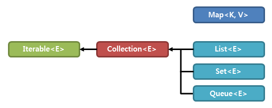

- 자료구조 특화 프레임워크.
- 데이터를 효율적으로 저장,관리,처리하기 위한 표준화 된 클래스 및 인터페이스의 집합이다.
- 사용법을 익히는데 약간의 진입장벽이 있지만, 반드시 익혀야한다.

| 인터페이스 | 구현체 | 특징 |
| --- | --- | --- |
| **Map<K.V>** | HashMap, TreeMap, Hashtable, Properties | 키 중복 X, 값 중복 O , key-value 쌍|
| 　 |
| **List<E>** | Vector, ArrayList, LinkedList, Stack, Queue | 순서 O, 중복 O |
| **Set<E>** | HashSet, TreeSet | 순서 X, 중복 X |

---

상속받는 인터페이스`Collection | Map`을 기준으로 2갈래의 종류로 나뉨.   

     - List와 Set은 `Collection 인터페이스`를 상속받으며 그에 따라 공통된 부분이 많다.  

     - Map은 키와 값 두개의 데이터를 한 쌍으로 다루기 때문에 Collection 인터페이스와 분리돼있다.  

---
### Collection 인터페이스 

{List, Set, Queue}인터페이스들에 상속을하는 실질적인 최상위 컬렉션 타입. 
즉, 업캐스팅으로 다양한 종류의 컬렉션 자료형을 받아 자료를 삽입하거나 삭제, 탐색 기능을 할 수 있다. (다형성)

### Iterable 인터페이스
컬렉션 인터페이스들의 최상위 인터페이스이다.
자료를 순회할 때 `iterator` 객체를 쓴다.

     Map은 iterable 인터페이스를 상속 받지 않기 때문에 `iterator()`같은 함수로 Map을 순회할 수 없음.
     
     - 간접적으로 key를 Collection으로 반환하고 루프문으로 순회하거나, 
     - 스트림`stream`으로 순회하면 된다.

| 객체_메서드 | 설명| 
|---|---|
|default void forEach(Consumer<? super T> action) | 함수형 프로그래밍 전용 루프 메서드|
|Iterator<T> iterator()| 컬렉션에서 이터레이터를 구현|
|default Spliterator<T> splierator()|파이프라이닝 관련 메소드|

### List 인터페이스 
- ArrayList 
- LinkedList 
- Vector 
- Stack 

### Quee 인터페이스
- PriorityQueue 
- Deque
- ArrayDeque
- LinkedList

### Set 인터페이스
- HashSet
- LinkedHashSet
- TreeSet
- EnumSet

---

## Map 인터페이스
- Map.Entry
- HashMap
- LinkedHashMap
- TreeMap
- HashTable
- Properties

---
